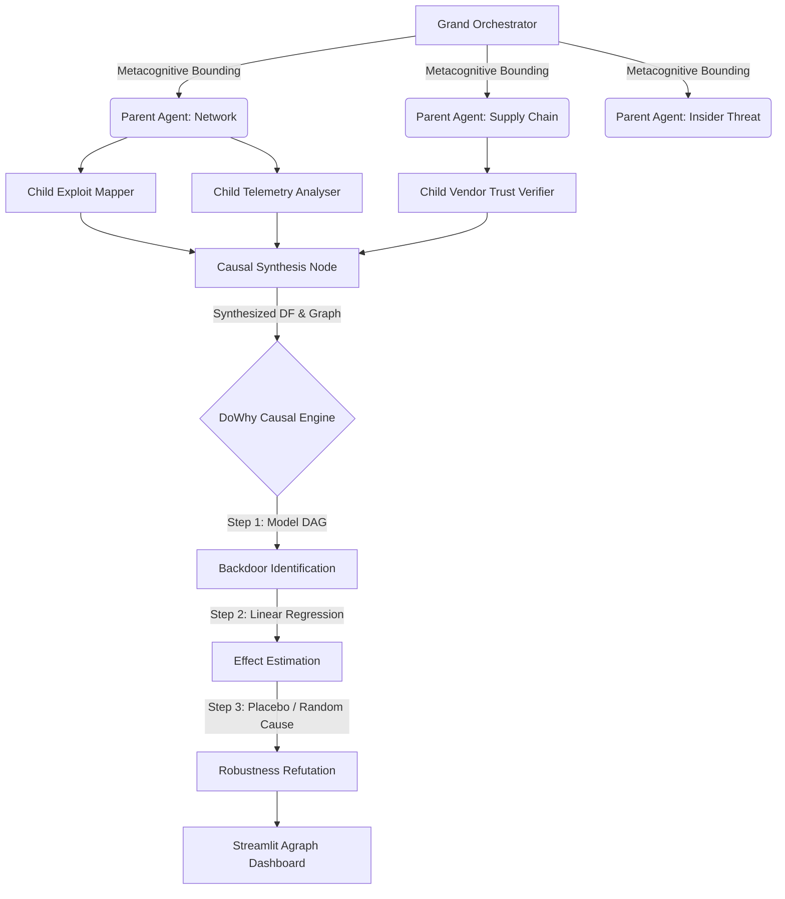

# HiveMind: Causal Digital Twin Engine

**A self-orchestrating, evolutionary multi-agent system for spatiotemporal causal mapping and strategic threat modeling.**

HiveMind has systematically evolved from a foundational multi-agent map-reduce concept into an advanced **Causal Digital Twin**. Using recursive architecture, it explores complex possibility spaces by spawning networks of AI agents. These agents analyze deeply dimensional threat vectors, which are then mathematically synthesized into Causal Directed Acyclic Graphs (DAGs) and structurally verified using rigorous computational math.

---

## Why HiveMind?

Modern strategic problems—especially in cybersecurity, red-teaming, or system design—are:
* **High-dimensional & Non-linear**: Hidden interactions obscure causality.
* **Too intricate for exhaustive human reasoning**: Human analysts hit cognitive limits when spanning global supply chains and insider threats simultaneously.

HiveMind approaches these problems not by asking an LLM for an answer, but by orchestrating an **Autonomous Investigation Cluster** that builds a verifiable structural model of the attack fabric.

---

## Core Capabilities

* **Recursive LangGraph Orchestration**: Utilizes the LangGraph `Send` API to dynamically spin up execution branches. The system starts at a `Grand Orchestrator`, delegates to specialized `Parent Agents`, and cascades into parallelized `Child Agents` that synthesize highly localized vectors.
* **Causal Inference Engine**: Bypasses simple LLM assumptions by embedding mathematical causality. Agents design interactive graph networks alongside simulated data, which is subsequently processed by the `DoWhy` library to execute the 4-step structural equation pipeline: **Model, Identify, Estimate, and Refute**.
* **LLM Graph Hallucination Sanitization**: Built-in state-processing sanitization algorithms automatically patch missing spatial definitions or mapping syntax errors from the LLM, maintaining geometric and mathematical stability.
* **Interactive Intelligence**: Embedded `streamlit-agraph` integration visually projects the compiled graph in real-time within the browser.
* **Air-gapped Agnostic Docker Base**: Fully disconnected from local environment package dependencies to eliminate complex multi-array Python math/C-extension library conflicts.

---

## Architectural Data Flow



---

## Key Components

### 1. Hierarchical LangGraph State
The entire ecosystem rests on typed Pydantic payloads acting as network schemas. Rather than a flat linear pipeline, execution traverses a deeply nested Direct Acyclic Graph (DAG) state capable of carrying isolated analytical memories.

### 2. Metacognitive Threat Analysts
Instead of generic agents, HiveMind invokes "SOC-Grade" structured metacognition. Agents write `DecisionMemos` actively detailing blind-spots, strategy, and explicit cognitive reasoning to defend their threat assessments.

### 3. DoWhy Mathematical Engine
HiveMind treats the LLM purely as a **Causal Architect**. The LLM constructs structural equations and simulated noise structures. This allows standard Pearlian computational math (via `statsmodels`, `scipy`, and `networkx`) to strip away correlation and isolate pure causal Treatment Effects.

---

## How to Run

To bypass all mathematical C-extension library conflicts associated with heavy scientific computing environments, HiveMind has been tightly containerized in Docker.

1. First, create your `.env` file at the root:
```env
AZURE_OPENAI_ENDPOINT=https://your-endpoint.openai.azure.com/
AZURE_OPENAI_API_KEY=your-api-key
AZURE_OPENAI_DEPLOYMENT=gpt-4o
AZURE_OPENAI_API_VERSION=2024-08-01-preview
```

2. Run the secure cluster:
```bash
docker-compose up --build
```
(Note: The first time you run this, it may take a while to download the base image and dependencies.)

(Note: --remove-orphans is used to remove any orphaned containers. So you can run: docker-compose up --build --remove-orphans  ,if ran more than once to start the cluster without any orphaned containers.)

Then access:
- Application: http://localhost:8080
- API Backend for testing: http://localhost:8000

(Note: If you get a "port already in use" error, you can change the ports in the `docker-compose.yml` file.)

## Notes
- The Frontend runs the Lovable React app.
- The API is the Python engine running the DoWhy and LangGraph logic.

---

## Status
HiveMind is an active research and engineering project originally conceived for the advanced systemic bounding of cyber landscapes.

## License
MIT License

---

If you are interested in collaborating, extending, or stress-testing HiveMind, open an issue or reach out to Darsh Garg (darsh.garg@gmail.com)
